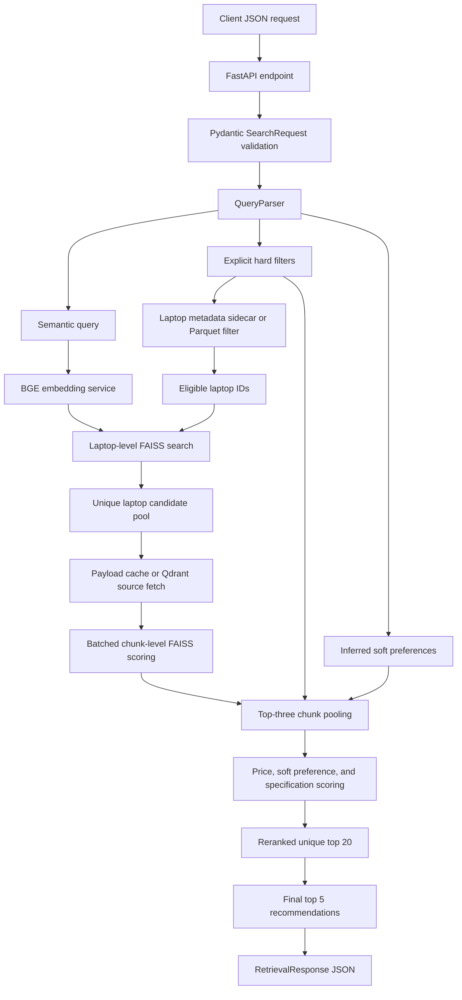
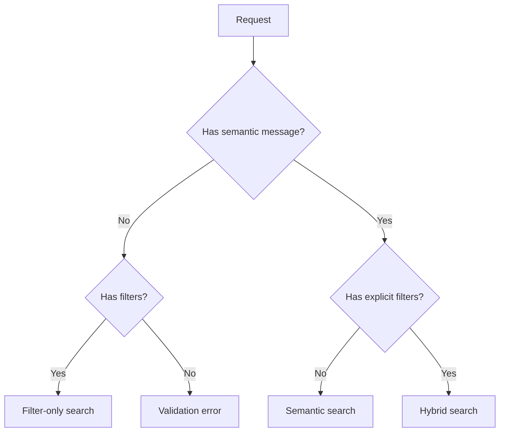
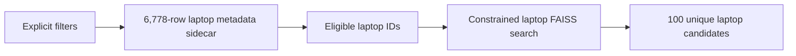
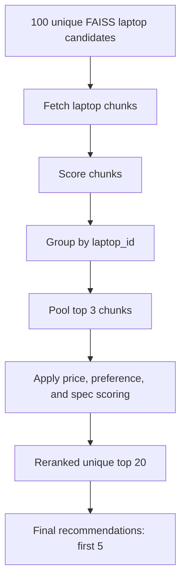
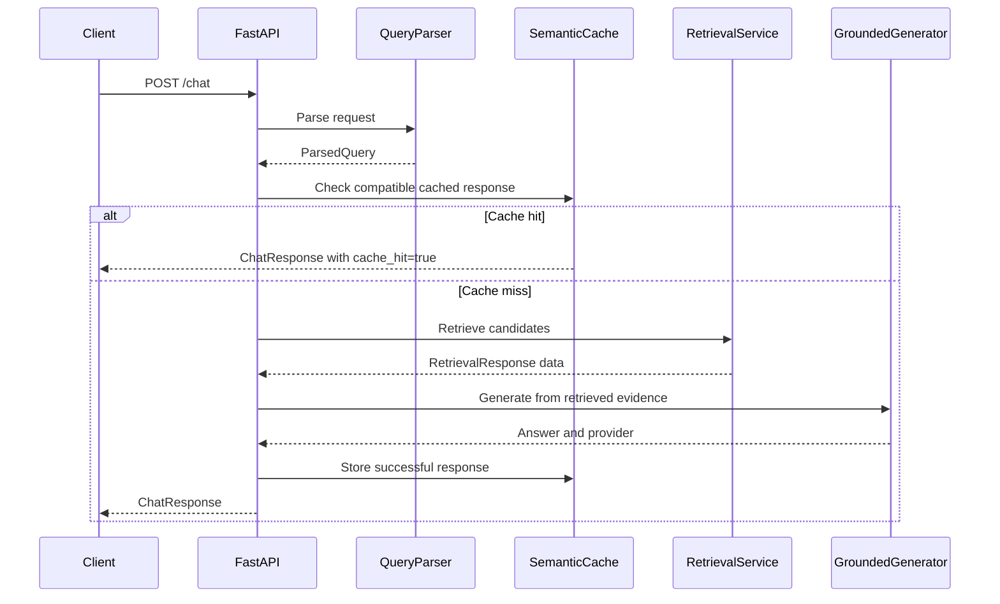

# Laptop RAG Query-to-JSON Architecture

This document describes how a laptop recommendation request travels through the
backend and becomes a JSON response.

The implementation is laptop-only and uses:

- FastAPI for the HTTP API.
- `BAAI/bge-base-en-v1.5` for 768-dimensional normalized embeddings.
- Laptop-level FAISS indexes for unique candidate retrieval.
- Chunk-level FAISS scoring for detailed evidence reranking.
- A 6,778-row laptop metadata Parquet sidecar for fast hard filtering.
- Qdrant Cloud for source payloads, with local Parquet as a full offline backend.
- Batched FAISS reconstruction, paired index caching, and bounded embedding and payload caches.
- Groq, Gemini, or retrieval-only output for `/chat`.

## Endpoints

| Endpoint | Purpose |
| --- | --- |
| `GET /health` | Reports service health and configured providers. |
| `GET /ready` | Returns successfully only when retrieval dependencies are ready. |
| `GET /settings/indexes` | Lists available FAISS indexes and settings. |
| `POST /retrieve` | Parses, retrieves, reranks, and returns recommendation JSON. |
| `POST /chat` | Runs retrieval and generates a grounded natural-language answer. |
| `GET /laptops/{laptop_id}` | Returns stored source chunks for one laptop. |
| `GET /insights/specifications` | Returns offline FP-Growth specification insights. |
| `GET /cache/stats` | Returns semantic cache statistics. |

Interactive API documentation is available at `/docs`.

## High-Level Architecture



In Qdrant mode, the local laptop sidecar determines eligibility without
scrolling all 63,998 Qdrant chunk points. Qdrant remains authoritative for
source payload retrieval. Retrieved laptop payloads are stored in a bounded
in-memory cache for subsequent requests.

## Request JSON

Example hybrid request:

```json
{
  "message": "Recommend a laptop for programming",
  "filters": {
    "max_price_usd": 1200,
    "min_ram_gb": 16,
    "min_storage_gb": 512
  },
  "index_type": "flat",
  "top_k": 5
}
```

### Request fields

| Field | Meaning |
| --- | --- |
| `message` | Natural-language semantic request. |
| `filters` | Explicit metadata constraints. |
| `index_type` | `flat`, `ivf_flat`, `pq`, `ivf_pq`, or `hnsw`. |
| `top_k` | Final recommendation count, limited to 1 through 5. |
| `nprobe` | IVF search parameter. |
| `ef_search` | HNSW search parameter. |
| `min_cosine_similarity` | Optional threshold override. |
| `allow_filter_relaxation` | Allows configured filter relaxation passes. Defaults to `false`. |
| `include_diagnostics` | Runs the extra global pre-filter search and populates `pre_filter_candidates`. Defaults to `false` for lower latency. |

The request does not accept a top-level `semantic_query`. The backend derives
that value from `message`.

Unknown fields are rejected because both `SearchRequest` and `SearchFilters`
forbid extra fields.

## Query Parsing

`QueryParser.parse()` produces a `ParsedQuery` containing:

```json
{
  "original_query": "Recommend a laptop for programming under $1200 with 16 GB RAM",
  "semantic_query": "Recommend a laptop for programming",
  "embedding_query": "Recommend a laptop for programming. Structured constraints: maximum price 1200 USD; at least 16 GB RAM.",
  "filters": {
    "max_price_usd": 1200,
    "min_ram_gb": 16
  },
  "inferred_filters": {
    "min_price_usd": 636.612
  },
  "locked_fields": [],
  "warnings": [
    "Inferred a soft minimum price from the requested maximum price."
  ]
}
```

### Original query

`original_query` preserves the normalized user text for auditing.

### Semantic query

Structured values are removed before semantic encoding.

```text
Original:
Recommend a laptop for programming under $1200 with 16 GB RAM

Semantic:
Recommend a laptop for programming
```

This keeps numeric constraints from dominating the meaning of the request.

### Explicit filters

`filters` contains values directly supplied by the user or frontend. These are
the hard metadata constraints used to select eligible laptops.

Examples:

```text
max_price_usd
min_price_usd
min_ram_gb
min_storage_gb
min_weight_kg
max_weight_kg
brands
gpu_tags
storage_types
operating_systems
```

### Inferred filters

The backend can infer the missing opposite side of a price or weight range.
These values are preferences only and are not used as hard metadata filters.

For example:

```text
max_price_usd = 1200
robust price spread = 563.388
inferred min_price_usd = 636.612
```

The inferred value affects ranking, but a laptop below `$636.612` is not
automatically rejected if it satisfies the explicit maximum price.

### Explicit versus inferred behavior

| Filter type | Used for metadata eligibility | Used for ranking |
| --- | ---: | ---: |
| Explicit price filter | Yes | Yes |
| Explicit RAM/storage/GPU filter | Yes | Yes through evidence and constraint scoring |
| Explicit weight filter | Yes | Yes |
| Inferred price range | No | Yes, softly |
| Inferred weight range | No | Yes, softly |

## Search Modes

The backend derives one of three search modes.



### Semantic search

Input contains a message but no explicit filters.

- The message is embedded.
- The laptop-level FAISS index is searched.
- Laptop chunks are fetched and reranked.

### Filter-only search

Input contains filters but no message.

- Embeddings are skipped.
- FAISS is skipped.
- Metadata is filtered directly.
- Matching laptops are ranked deterministically by the filter-only path.

### Hybrid search

Input contains both a message and explicit filters.

- The explicit filters produce eligible laptop IDs.
- FAISS search is constrained to those laptop IDs.
- Semantic and specification evidence are used to rank the eligible laptops.

## Embedding Process

The embedding service generates normalized vectors:

```text
query vector = normalize(BGE(embedding_query))
```

For hybrid retrieval, two query vectors are used:

```text
filter-aware vector = BGE(semantic query + explicit constraints)
semantic-only vector = BGE(semantic query)
```

The filter-aware vector is used for candidate retrieval. The semantic-only
vector is used as an independent relevance signal during reranking.

Both vectors are generated in one batched `encode_many()` call. The embedding
service maintains a bounded exact-text cache, so repeated semantic and
filter-aware strings return normalized cached vectors without another model
inference. Cache access and model inference are serialized under the embedding
service lock so concurrent requests cannot mutate shared model/cache state.

Inferred opposite ranges are intentionally not added to `embedding_query`.
They are applied later as soft ranking preferences so heuristic ranges cannot
remove semantically relevant candidates.

## FAISS Retrieval

The system stores two categories of indexes.

### Laptop-level indexes

The artifacts contain chunk-level evidence vectors plus one aggregate vector
per unique laptop:

```text
63,998 chunk vectors
6,778 laptop vectors
```

The laptop vector is created by averaging the laptop's chunk vectors and
normalizing the result.

Laptop-level files include:

```text
laptop_flat.index
laptop_ivf_flat.index
laptop_pq.index
laptop_ivf_pq.index
laptop_hnsw.index
```

These indexes prevent multiple chunks from the same laptop from consuming the
candidate slots.

### Index residency and vector reconstruction

The FAISS cache holds two indexes by default:

```text
INDEX_CACHE_SIZE=2
```

This allows the selected laptop index and matching chunk index to remain
resident together. The default pair is loaded during service startup.

Constrained search and chunk reranking use `reconstruct_batch()` rather than
calling `reconstruct()` once per vector. Semantic-only and filter-aware scores
are calculated from the same reconstructed matrix:

```text
selected vector IDs
-> one batch reconstruction
-> one normalized matrix
-> matrix multiplication against both query vectors
```

This removes repeated Python/FAISS boundary calls and avoids reconstructing the
same chunk vectors twice.

### Candidate depth

The backend searches an internal pool of up to 100 unique laptop candidates:

```python
search_k = max(candidate_k * 5, top_k * 20)
```

With the default settings:

```text
candidate_k = 20
top_k = 5
search_k = 100
```

The internal 100 candidates are later reranked using metadata and chunk
evidence.

## Hard Metadata Filtering

For hybrid retrieval, the backend first obtains eligible laptop IDs from a
laptop-level metadata table containing one row per laptop.



Metadata behavior by deployment mode:

| Mode | Eligibility filtering | Source payloads |
| --- | --- | --- |
| Qdrant production | `laptop_metadata.parquet` sidecar | Qdrant Cloud |
| Local Parquet | In-memory unique-laptop DataFrame | Local Parquet |

The sidecar avoids scrolling and deduplicating matching chunk points merely to
discover eligible laptop IDs. Qdrant eligibility fallback remains available if
the sidecar artifact is absent.

Examples of hard constraints:

```text
max_price_usd <= 1200
min_ram_gb >= 16
min_storage_gb >= 512
max_weight_kg <= 1.6
brand in {dell, lenovo}
```

If `allow_filter_relaxation` is `false`, explicit filters remain locked.

If relaxation is enabled, the backend tries filter passes in this order:

```text
strict
preferences_relaxed
main_requirements
core_requirements
locked_only
```

The response lists any relaxed fields in `relaxed_filters`.

When relaxation is disabled, the system does not send already-approved chunk
IDs through the same strict metadata filters again. Relaxation-enabled requests
retain the multi-pass metadata path.

## Chunk Evidence Reranking

After laptop candidates are selected, the backend obtains the chunks belonging
to those laptops. A bounded immutable payload cache is checked first; cache
misses are fetched from Qdrant or Parquet and then retained for reuse.

For each chunk, it calculates:

```text
semantic_score
filter_aware_score
```

The chunk ranking score is:

```text
chunk_score =
    0.65 * semantic_score
  + 0.35 * filter_aware_score
```

Both scores are cosine-like similarities between normalized vectors. They are
not percentages or probabilities.

Chunks below the selected index threshold are removed from final ranking.

Chunk vectors for both query variants are scored in one batched operation. The
metadata payload cache stores source dictionaries only; FAISS remains the
source of vector scores.

## Laptop Evidence Pooling

A laptop can have several relevant chunks. The backend combines the strongest
three chunks:

```text
laptop_text_score =
    0.60 * best_chunk_score
  + 0.25 * second_chunk_score
  + 0.15 * third_chunk_score
```

This reduces the impact of one accidental chunk match and prevents the final
score from being only `max(chunk_score)`.

## Price Proximity Score

For an explicit maximum price:

```text
price_fit_score = laptop_price / maximum_price
```

Example:

```text
laptop price = 1100
maximum price = 1200
price_fit_score = 1100 / 1200 = 0.9167
```

For an explicit minimum price:

```text
price_fit_score = minimum_price / laptop_price
```

Price proximity never overrides an explicit hard filter.

## Specification Score

The specification score is exposed as both `spec_score` and `value_score`.
They currently contain the same value for compatibility.

```text
CPU: 30%
RAM: 20%
GPU: 20%
Storage: 15%
Display: 10%
Battery: 5%
```

The current scoring behavior is approximately:

```text
CPU:
  high-end CPU: 1.00
  mid-range CPU: 0.80
  entry-level CPU: 0.55

RAM:
  min(ram_gb / 16, 1)

Storage:
  min(storage_gb / 512, 1)

GPU:
  RTX: 1.00
  GTX, Radeon, RX, or Arc: 0.85
  integrated: 0.60

Display:
  suitable display size and resolution score higher

Battery:
  min(battery_Wh / 60, 1)
```

Missing metadata does not automatically produce a zero. Available component
weights are renormalized.

## Final Ranking Formula

When an explicit price constraint exists:

```text
final_score =
    0.55 * laptop_text_score
  + 0.20 * price_fit_score
  + 0.10 * soft_preference_score
  + 0.15 * spec_score
```

When there is no explicit price constraint:

```text
final_score =
    0.75 * laptop_text_score
  + 0.10 * soft_preference_score
  + 0.15 * spec_score
```

The final score is a ranking score, not a calibrated relevance probability.

`constraint_fit_score` is exposed for diagnostics. Explicit constraints are
already enforced by metadata filtering, so `constraint_fit_score` is not an
additional term in the final formula.

## Top-20 and Top-5 Output

The backend first creates up to 20 reranked unique laptop candidates.



The following invariant is expected:

```text
recommendations is a subset of candidate_hits
```

`candidate_hits` are laptop-level records. Their `vector_id` identifies a
representative source chunk, while `laptop_id` identifies the unique product.

## Response JSON

A simplified response has this structure:

```json
{
  "status": "ok",
  "search_mode": "hybrid",
  "index_used": "hnsw",
  "candidate_k": 20,
  "metadata_match_count": 1234,
  "pre_filter_candidates": [],
  "candidate_hits": [
    {
      "vector_id": 123,
      "laptop_id": 456,
      "model": "Example Laptop",
      "price_usd": 1100,
      "score": 0.799054,
      "semantic_score": 0.641687,
      "filter_aware_score": 0.697550,
      "price_fit_score": 0.916667,
      "spec_score": 0.970000,
      "soft_preference_score": 1.0
    }
  ],
  "requested_top_k": 5,
  "matched_count": 5,
  "relaxed_filters": [],
  "parsed_query": {},
  "top_similarity": 0.716,
  "top_ranking_score": 0.799054,
  "similarity_threshold": 0.6689,
  "outlier": false,
  "recommendations": [],
  "retrieval_latency_ms": 75.534,
  "timings_ms": {
    "parse": 0.342,
    "embedding": 0.470,
    "metadata_filter": 5.874,
    "laptop_search": 22.324,
    "metadata_fetch": 7.970,
    "chunk_score": 17.449,
    "filter_and_rerank": 16.172
  }
}
```

The timing values above are a representative warm Docker/Qdrant request, not a
service-level guarantee. A cold request can include model, index, and Qdrant
payload-loading costs.

### Important response fields

| Field | Meaning |
| --- | --- |
| `status` | `ok`, `no_metadata_match`, or `no_relevant_match`. |
| `search_mode` | Semantic, filter-only, or hybrid. |
| `index_used` | Selected chunk/laptop FAISS family. |
| `metadata_match_count` | Number of laptops satisfying explicit hard filters. |
| `pre_filter_candidates` | Optional hybrid candidates before hard metadata filtering; populated when `include_diagnostics=true`. |
| `candidate_hits` | Reranked unique top-20 laptop candidates. |
| `recommendations` | Final top-five laptop recommendations. |
| `top_similarity` | Highest chunk-level filter-aware similarity. |
| `top_ranking_score` | Highest final laptop ranking score. |
| `similarity_threshold` | Threshold used to accept chunk evidence. |
| `relaxed_filters` | Explicit fields relaxed during fallback filtering. |
| `retrieval_latency_ms` | Retrieval duration in milliseconds. |
| `timings_ms` | Parse, embedding, metadata, FAISS, scoring, and reranking stage timings. |

### Timing stages

| Timing key | Included work |
| --- | --- |
| `parse` | Query normalization, constraint extraction, and inferred preferences. |
| `embedding` | Batched BGE inference or exact embedding-cache lookup. |
| `metadata_filter` | Laptop-sidecar hard filtering. |
| `laptop_search` | Unique laptop FAISS candidate search. |
| `metadata_fetch` | Payload-cache lookup and Qdrant/Parquet misses. |
| `chunk_score` | Batch reconstruction, normalization, and dual-query matrix scoring. |
| `filter_and_rerank` | Thresholding, optional relaxation, pooling, and final scoring. |
| `diagnostics` | Optional global pre-filter search when `include_diagnostics=true`. |

### Recommendation fields

| Field | Meaning |
| --- | --- |
| `score` | Composite final ranking score. |
| `semantic_score` | Aggregated semantic relevance score. |
| `filter_aware_score` | Aggregated score from the query with explicit constraints. |
| `price_fit_score` | Proximity to the explicit price bound. |
| `soft_preference_score` | Weight, inferred-range, and intent preference score. |
| `spec_score` | CPU, RAM, GPU, storage, display, and battery score. |
| `constraint_fit_score` | Diagnostic hard/relaxed constraint fit. |
| `metadata` | Best source laptop metadata. |
| `sources` | Up to three supporting source chunks. |

## Optimized Execution Path

For a hybrid semantic request, the optimized warm path is:

```mermaid
flowchart LR
    A[Request] --> B[Query parser]
    B --> C{Embedding cache hit?}
    C -- Yes --> D[Cached normalized vectors]
    C -- No --> E[One batched BGE encode]
    E --> D
    D --> F[Laptop sidecar filter]
    F --> G[Resident laptop FAISS index]
    G --> H[Up to 100 unique laptops]
    H --> I{Payload cache hit?}
    I -- Yes --> J[Cached source payloads]
    I -- No --> K[Qdrant or Parquet fetch]
    K --> J
    J --> L[Resident chunk FAISS index]
    L --> M[Batch reconstruct vectors once]
    M --> N[Score both query vectors]
    N --> O[Pool, price, preference, and spec reranking]
    O --> P[Top 20 and final top 5]
```



### Cache layers

| Cache | Key | Value | Purpose |
| --- | --- | --- | --- |
| Embedding cache | Exact normalized query text | Normalized BGE vector | Avoid repeated model inference. |
| FAISS index cache | Laptop/chunk index family | Loaded FAISS object | Keep both indexes resident. |
| Laptop payload cache | `laptop_id` | Source payload dictionaries | Avoid repeated Qdrant/Parquet payload fetches. |
| Chat semantic cache | Request namespace and similar query vector | Complete `ChatResponse` | Reuse compatible generated answers. |

### Measured improvement

The same 225-request in-process evaluation was executed before and after the
optimization while preserving the measured ranking and filter metrics.

| Index | Baseline p50 | Optimized p50 | Reduction | Speedup |
| --- | ---: | ---: | ---: | ---: |
| Flat | 552.658 ms | 128.604 ms | 76.7% | 4.30x |
| IVF Flat | 582.898 ms | 49.949 ms | 91.4% | 11.67x |
| PQ | 452.876 ms | 56.937 ms | 87.4% | 7.95x |
| IVF PQ | 456.498 ms | 51.629 ms | 88.7% | 8.84x |
| HNSW | 563.200 ms | 53.682 ms | 90.5% | 10.49x |

Live HNSW Docker/Qdrant verification for the same repeated request measured:

```text
warm retrieval before laptop sidecar: 3354.488 ms
warm retrieval after all optimizations: 75.534 ms
warm reduction: 97.7%
```

Detailed methodology and before/after results are available in:

```text
description/performance_optimization_report.md
description/backend_metrics_report.json
description/backend_metrics_report_optimized.json
```

The relevance labels in those reports are Flat-KNN pseudo-labels. They verify
that optimization preserved measured behavior; independent human labels are
still required for final recommendation-quality claims.

## `/chat` Flow

`POST /chat` uses the same parsing and retrieval process, then generates a
grounded answer.



The provider fallback order is:

```text
Groq -> Gemini -> retrieval-only response
```

The cache namespace includes filters, index settings, parser policy, dataset
version, prompt version, and model settings.

## Error and Outlier Behavior

### Validation error

Invalid request fields produce HTTP `422`.

Examples:

- Missing both `message` and `filters`.
- Unknown filter field.
- Reversed price range.
- Reversed weight range.
- `top_k` greater than 5.

### No metadata match

If no laptop satisfies the explicit hard constraints:

```json
{
  "status": "no_metadata_match",
  "recommendations": []
}
```

### No relevant match

If the best chunk evidence is below the selected threshold:

```json
{
  "status": "no_relevant_match",
  "outlier": true,
  "recommendations": []
}
```

## Code Map

| Responsibility | File |
| --- | --- |
| HTTP routes and response serialization | `Backend/app/main.py` |
| Request and response schemas | `Backend/app/models.py` |
| Query parsing and soft range inference | `Backend/app/services/parser.py` |
| Retrieval orchestration and scoring | `Backend/app/services/retrieval.py` |
| FAISS loading and search | `Backend/app/services/faiss_manager.py` |
| Embedding generation | `Backend/app/services/embeddings.py` |
| Local metadata filtering | `Backend/app/services/local_metadata_store.py` |
| Qdrant filtering | `Backend/app/services/qdrant_store.py` |
| Qdrant payloads with local laptop filtering | `Backend/app/services/hybrid_metadata_store.py` |
| Filter relaxation passes | `Backend/app/services/filtering.py` |
| Chat orchestration and cache | `Backend/app/services/rag.py` |
| LLM answer generation | `Backend/app/services/generator.py` |
| Chunk and laptop artifact generation | `Backend/scripts/build_artifacts.py` |
| Laptop metadata sidecar generation | `Backend/scripts/build_laptop_metadata.py` |
| Laptop index generation | `Backend/scripts/build_laptop_indexes.py` |

## Verification Checklist

For each test request, verify:

```text
candidate_hits.length <= 20
candidate_hits laptop_id values are unique
recommendations.length <= requested_top_k
every recommendation laptop_id exists in candidate_hits
explicit hard filters are satisfied
price_fit_score is populated when a price bound is supplied
spec_score is populated and varies with hardware evidence
relaxed_filters is empty unless relaxation was requested
pre_filter_candidates is empty unless include_diagnostics is true
timings_ms contains the stages executed by the selected search mode
```

Useful test requests include:

```json
{
  "message": "Recommend a laptop for programming",
  "filters": {
    "max_price_usd": 1200,
    "min_ram_gb": 16,
    "min_storage_gb": 512
  },
  "index_type": "flat",
  "top_k": 5
}
```

```json
{
  "message": "Recommend a gaming laptop with strong graphics",
  "filters": {
    "max_price_usd": 1500,
    "min_ram_gb": 16,
    "gpu_tags": ["rtx"]
  },
  "index_type": "ivf_flat",
  "top_k": 5
}
```

```json
{
  "message": "Recommend a lightweight laptop for travel",
  "filters": {
    "max_price_usd": 1000,
    "max_weight_kg": 1.5,
    "min_ram_gb": 8
  },
  "index_type": "hnsw",
  "top_k": 5
}
```
