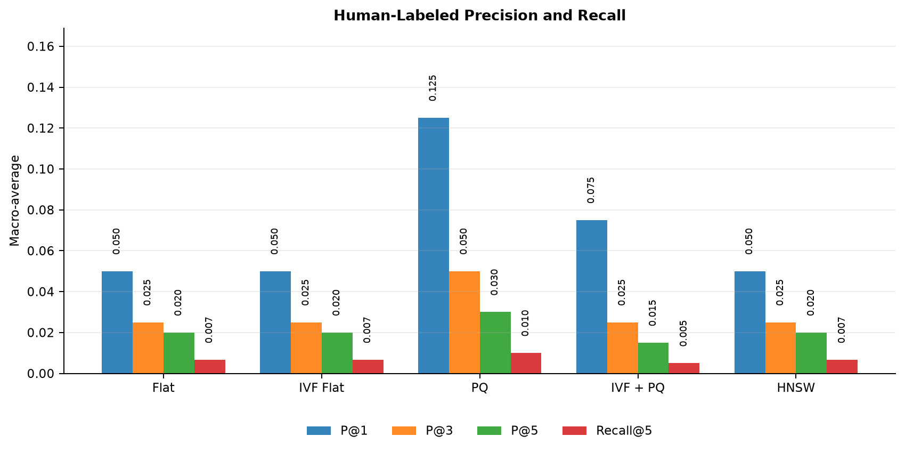
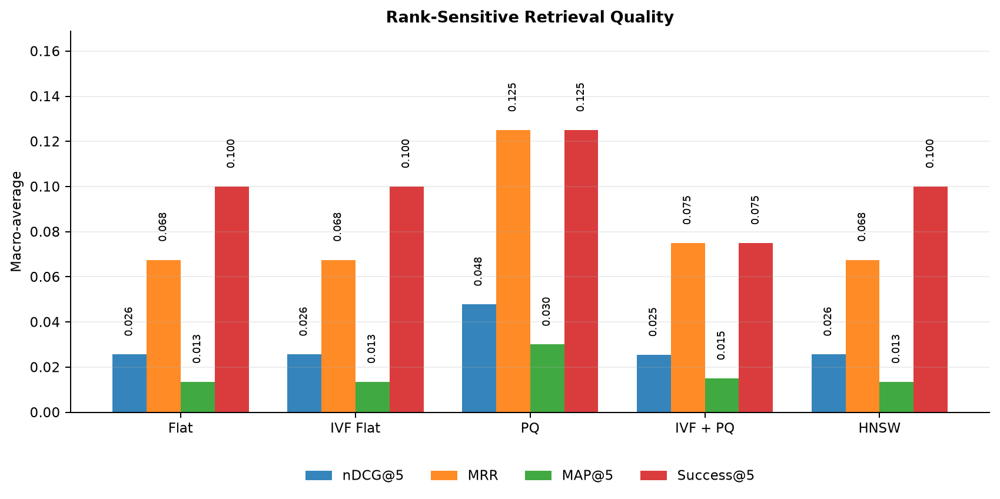
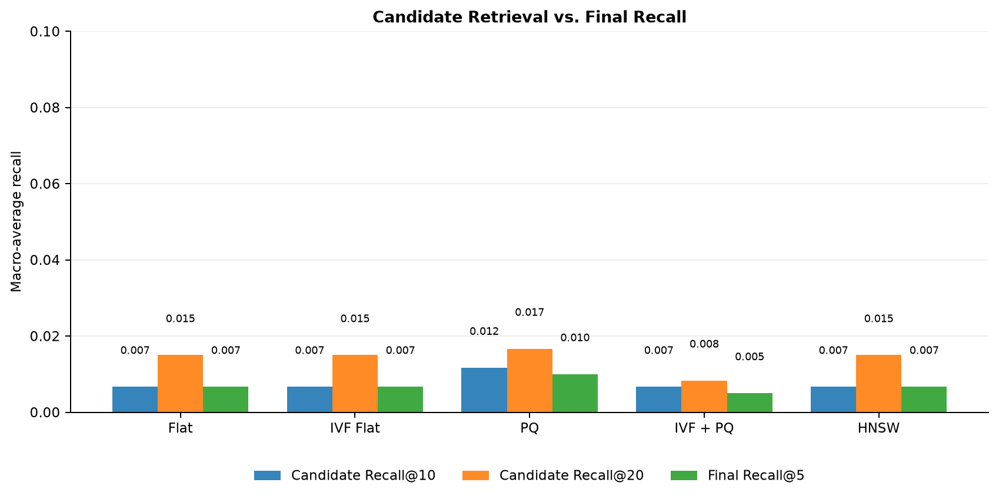
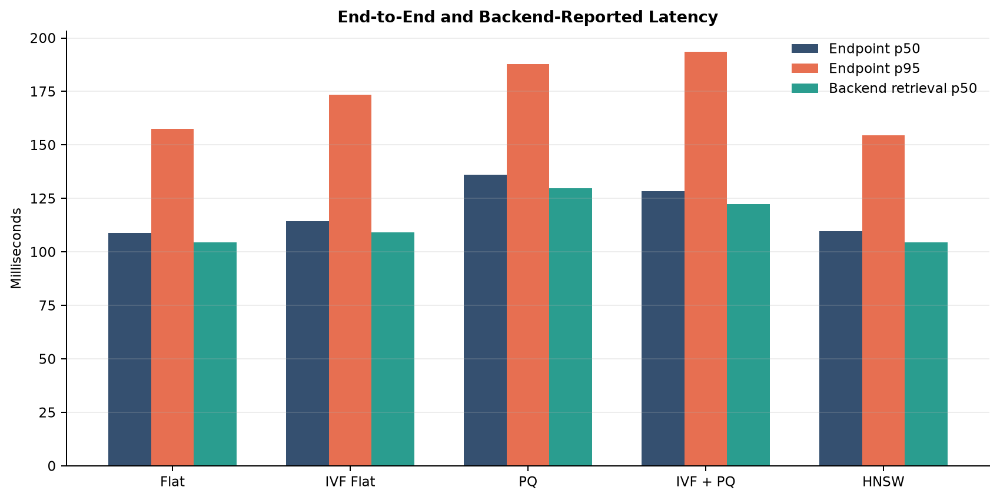
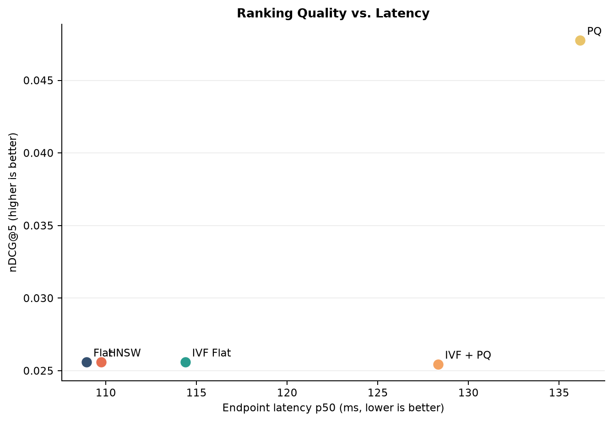
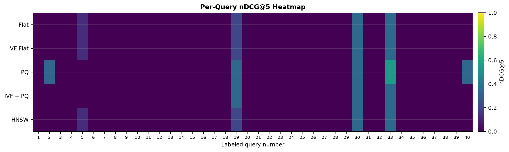

# Hand-Labeled Laptop Retrieval Evaluation

Generated: `2026-08-24T19:40:57.887354+00:00`

## Executive Summary

This evaluation measures five FAISS configurations against **40 hand-labeled queries**, **600 binary relevance judgments**, and **5 out-of-domain queries**. It uses the corrected artifact set with **8,485 laptops** and **127,996 text chunks**.

- **Highest ranking quality:** PQ with nDCG@5 `0.048`.
- **Lowest median endpoint latency:** Flat at `108.9 ms` p50.
- **Production recommendation:** none from this relevance run. The best nDCG@5 is below `0.05`, and the bootstrap intervals overlap; label/artifact alignment and candidate generation should be audited before choosing an index on quality.
- **Exploratory quality/latency point:** PQ is within 5% of the best observed nDCG@5 and has `136.2 ms` p50 latency, but this is not an acceptance result.
- **Outlier rejection:** best observed rate is `1.000`; this is only exploratory because the outlier set has five queries.

## Evaluation Design

| Item | Value |
| --- | --- |
| Label provenance | human_judgment |
| Labeled queries | 40 |
| Relevant IDs per query | 15 |
| Total query-item relevance judgments | 600 |
| Unique judged-relevant laptops | 377 |
| Out-of-domain queries | 5 |
| Indexes | Flat, IVF Flat, PQ, IVF + PQ, HNSW |
| Final cutoff | Top 5 recommendations |
| Candidate cutoffs | Top 10 and top 20 |
| Execution | in-process:parquet |
| Discarded warm-up passes | 1 |

Each query was sent to `/retrieve` with `top_k=5` and diagnostics enabled. The same query set was evaluated independently against Flat, IVF Flat, Product Quantization (PQ), IVF + PQ, and HNSW. Metrics are macro-averaged across queries, so each query contributes equally.

### Metric Definitions

- **Precision@k:** relevant returned laptops divided by k.
- **Recall@k:** relevant returned laptops divided by all 15 judged-relevant laptops for that query.
- **nDCG@5:** rank-sensitive gain normalized by the ideal top-five ordering; binary relevance is used.
- **MRR:** reciprocal rank of the first relevant result.
- **MAP@5:** mean of per-query average precision through rank five.
- **Success@5:** fraction of queries with at least one relevant result in the top five.
- **Candidate Recall@20:** fraction of judged-relevant items entering the pre-reranking candidate set.
- **Endpoint latency:** evaluator-observed request time, including parsing, embedding, metadata work, FAISS, and reranking.

Because each query has 15 relevant labels but only five returned slots, the mathematical ceiling for Recall@5 is `5/15 = 0.333`. Precision@5 and nDCG@5 are therefore more intuitive measures of top-five quality.

## Aggregate Results

| Index | P@1 | P@3 | P@5 | R@5 | nDCG@5 | MRR | MAP@5 | Success@5 |
| --- | ---: | ---: | ---: | ---: | ---: | ---: | ---: | ---: |
| Flat | 0.050 | 0.025 | 0.020 | 0.007 | 0.026 | 0.068 | 0.013 | 10.00% |
| IVF Flat | 0.050 | 0.025 | 0.020 | 0.007 | 0.026 | 0.068 | 0.013 | 10.00% |
| PQ | 0.125 | 0.050 | 0.030 | 0.010 | 0.048 | 0.125 | 0.030 | 12.50% |
| IVF + PQ | 0.075 | 0.025 | 0.015 | 0.005 | 0.025 | 0.075 | 0.015 | 7.50% |
| HNSW | 0.050 | 0.025 | 0.020 | 0.007 | 0.026 | 0.068 | 0.013 | 10.00% |

### Bootstrap Uncertainty

The intervals below are nonparametric 95% bootstrap confidence intervals over the 40 query rows (5,000 deterministic resamples). They quantify query-sampling uncertainty, not labeling uncertainty.

| Index | nDCG@5 mean [95% CI] | P@5 mean [95% CI] |
| --- | ---: | ---: |
| Flat | 0.026 [0.003, 0.054] | 0.020 [0.005, 0.040] |
| IVF Flat | 0.026 [0.003, 0.054] | 0.020 [0.005, 0.040] |
| PQ | 0.048 [0.008, 0.092] | 0.030 [0.005, 0.060] |
| IVF + PQ | 0.025 [0.000, 0.059] | 0.015 [0.000, 0.035] |
| HNSW | 0.026 [0.003, 0.054] | 0.020 [0.005, 0.040] |

## Candidate Retrieval and Reranking

| Index | Candidate P@10 | Candidate R@10 | Candidate P@20 | Candidate R@20 | Final subset rate |
| --- | ---: | ---: | ---: | ---: | ---: |
| Flat | 0.010 | 0.007 | 0.011 | 0.015 | 100.00% |
| IVF Flat | 0.010 | 0.007 | 0.011 | 0.015 | 100.00% |
| PQ | 0.018 | 0.012 | 0.013 | 0.017 | 100.00% |
| IVF + PQ | 0.010 | 0.007 | 0.006 | 0.008 | 100.00% |
| HNSW | 0.010 | 0.007 | 0.011 | 0.015 | 100.00% |

Candidate Recall@20 diagnoses whether judged-relevant items were available to the final reranker. Here, even the best Candidate Recall@20 is only `0.017`. The dominant issue is therefore upstream candidate generation and/or alignment between the judgment IDs and the current artifact set; reranking cannot select relevant laptops that never enter its pool.

## Latency

| Index | Endpoint mean | Endpoint p50 | Endpoint p95 | Endpoint p99 | Retrieval p50 | Retrieval p95 |
| --- | ---: | ---: | ---: | ---: | ---: | ---: |
| Flat | 115.3 ms | 108.9 ms | 157.6 ms | 340.8 ms | 104.3 ms | 151.6 ms |
| IVF Flat | 122.2 ms | 114.4 ms | 173.5 ms | 315.3 ms | 109.3 ms | 160.2 ms |
| PQ | 140.2 ms | 136.2 ms | 187.8 ms | 452.0 ms | 129.8 ms | 179.8 ms |
| IVF + PQ | 138.1 ms | 128.3 ms | 193.5 ms | 527.4 ms | 122.3 ms | 186.1 ms |
| HNSW | 113.5 ms | 109.7 ms | 154.4 ms | 303.6 ms | 104.6 ms | 144.1 ms |

These are warm-process, single-request (`concurrency=1`) in-process measurements after `1` discarded full pass(es) on this machine. They are appropriate for relative index comparison but should not be presented as public-deployment SLA measurements. Network latency is excluded by the in-process transport.

## Operational Invariants

| Index | Errors | Hard-filter satisfaction | Unique candidates | Final subset | Outlier rejection |
| --- | ---: | ---: | ---: | ---: | ---: |
| Flat | 0.00% | 100.00% | 100.00% | 100.00% | 100.00% |
| IVF Flat | 0.00% | 100.00% | 100.00% | 100.00% | 100.00% |
| PQ | 0.00% | 100.00% | 100.00% | 100.00% | 100.00% |
| IVF + PQ | 0.00% | 100.00% | 100.00% | 100.00% | 100.00% |
| HNSW | 0.00% | 100.00% | 100.00% | 100.00% | 100.00% |

The error rate should be 0%. Hard-filter satisfaction checks the structured constraints inferred by the backend against returned metadata. Unique-candidate and final-subset rates validate retrieval pipeline invariants rather than relevance quality.

## Per-Query Analysis

### Five Most Difficult Queries

| Query | Mean nDCG@5 across indexes |
| --- | ---: |
| Gaming laptop under 1500 USD with at least 16 GB RAM and RTX graphics | 0.000 |
| Laptop for university programming with 16 GB RAM | 0.000 |
| Lightweight student laptop under 2 kg with long battery life | 0.000 |
| Portable professional laptop with a bright display and good battery life | 0.000 |
| Programming laptop with a powerful CPU and at least 512 GB storage | 0.000 |

### Five Strongest Queries

| Query | Mean nDCG@5 across indexes |
| --- | ---: |
| Laptop between 1000 and 1800 USD for creative professionals | 0.382 |
| Linux laptop for programming with at least 16 GB RAM | 0.339 |
| Acer laptop with at least 512 GB storage and Windows | 0.264 |
| Business laptop with a comfortable keyboard under 1200 USD | 0.079 |
| Laptop with RTX graphics, 32 GB RAM, and at least 1 TB storage | 0.068 |

The heatmap reveals whether failures are systematic across every index (usually query interpretation, judgment mismatch, or reranking) or isolated to compressed/approximate indexes (an ANN quality issue).

## Interpretation

1. **Index choice:** no index clears a defensible relevance threshold. PQ has the highest point estimate, but its confidence interval overlaps the other indexes and nDCG@5 remains below 0.05.
2. **Top-five focus:** nDCG@5, P@5, MAP@5, and Success@5 are the primary product-facing metrics. Raw Recall@5 is intentionally capped at 0.333 by the evaluation design.
3. **Retrieval vs. reranking:** Candidate Recall@20 is extremely weak, so first verify that the labeled laptop IDs and current artifacts describe the same catalog, then inspect query parsing/filters and widen ANN search breadth (`nprobe`, `efSearch`, candidate count) before tuning reranking weights.
4. **Outliers:** rejection results are encouraging only if consistently high, but five examples are too few for a production false-accept claim.

## Limitations

1. Relevance is binary. The order of `relevant_laptop_ids` is ignored and no graded relevance levels were supplied.
2. The 40 queries are sufficient for the course requirement but still produce broad confidence intervals for close index comparisons.
3. The judgment pool may omit relevant laptops that were never presented to annotators; unjudged returned items are treated as non-relevant.
4. Only five out-of-domain queries were evaluated. At least 30 diverse outliers are recommended for a stable rejection estimate.
5. The same broader query family was previously used for threshold calibration; a separate held-out test split would reduce evaluation leakage.
6. Latency is measured in-process on one machine after model startup. Cold-start, concurrent-load, network, and hosted-deployment latency are not represented.
7. Statistical intervals reflect variation across queries only; they do not measure annotator disagreement. Multiple assessors or agreement statistics would strengthen the labels.

## Reproducibility Artifacts

- Raw metrics JSON: `hand_labeled_metrics.json`
- Aggregate metrics CSV: `hand_labeled_evaluation_summary.csv`
- Per-query metrics CSV: `hand_labeled_per_query_metrics.csv`
- Charts: `hand_labeled_evaluation_charts`
- Labels: `Backend/evaluation/queries.jsonl`
- Outliers: `Backend/evaluation/outliers.jsonl`
